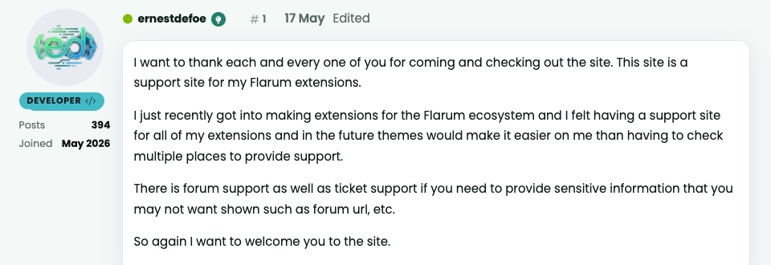
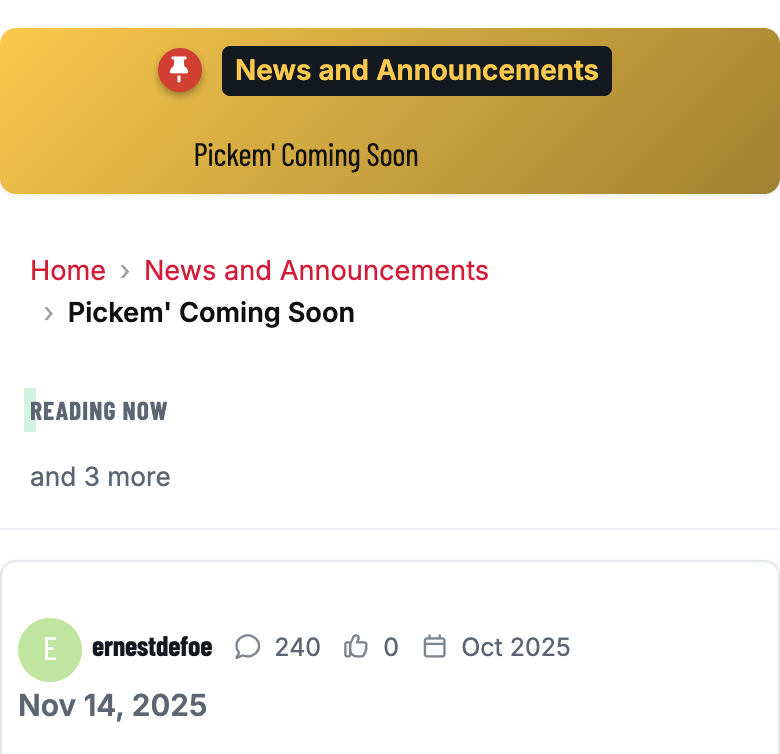
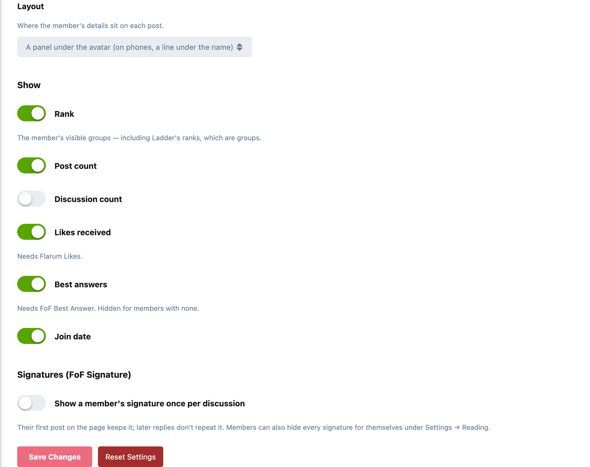

# Nameplate

The member's panel beside every post, the way traditional forums have always
shown it: who wrote this, and who they are on this forum.



Under each author's avatar:

- **Rank:** their visible groups, as coloured labels. [Ladder](https://github.com/ernestdefoe/ladder)'s post-count ranks are groups, so they show here automatically.
- **Posts** and, if you want it, **discussions**.
- **Likes received**, with [Flarum Likes](https://github.com/flarum/likes).
- **Best answers**, with [FoF Best Answer](https://github.com/FriendsOfFlarum/best-answer), for members who have any.
- **Join date.**

On a phone there's no side column, so the same details sit in one line beside the author's name:



Prefer that compact line everywhere? It's a setting.

## Signatures

Nameplate doesn't add signatures. [FoF Signature](https://github.com/FriendsOfFlarum/signature) does that well. When it's installed, Nameplate adds two things it doesn't have:

- **Show a member's signature once per discussion.** Their first post on the page keeps it, and their later replies don't repeat it. (An admin setting.)
- **Hide signatures.** A switch for each member, under **Settings → Reading**, to stop seeing other people's signatures.

## Settings

Admin → Nameplate:



- **Layout:** a panel under the avatar (a line on phones), or one line under the name everywhere
- **Show:** rank, post count, discussion count, likes received, best answers and join date, each on or off
- **Signatures:** once per discussion

It uses your theme's own colours, so it fits the default theme, Bespoke and others without styling.

## Good to know

- **No extra load per post.** Post counts, join dates and groups already arrive with every post. Likes received is the one figure that needs counting, so it's cached for each member and refreshed whenever one of their posts is liked or unliked.
- **Optional extensions stay optional.** Likes and best answers only appear when those extensions are installed; nothing breaks without them.

## Installation

```bash
composer require ernestdefoe/nameplate
php flarum cache:clear
```

Then enable **Nameplate** in the admin panel.

## Updating

```bash
composer update ernestdefoe/nameplate
php flarum cache:clear
```

## Licence

MIT.
